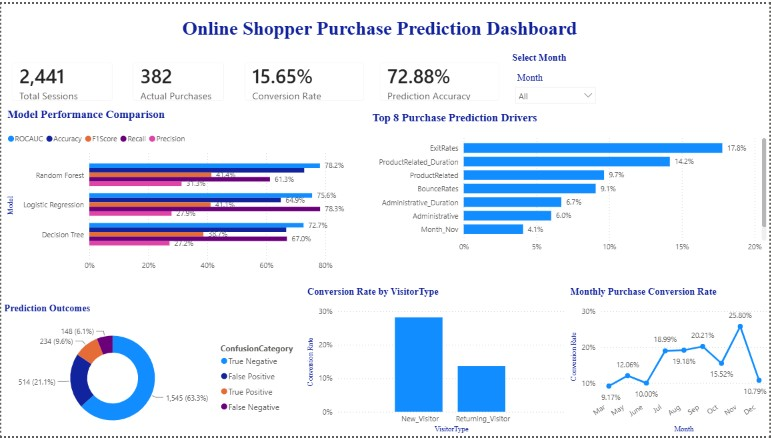

# Online Shopper Purchase Prediction Dashboard

## Project Overview

This end-to-end predictive analytics project examines whether the behavior recorded during an online-shopping session can be used to predict if the visitor will complete a purchase. The business objective is to help e-commerce teams recognize high-intent sessions, understand the behaviors associated with conversion, and identify opportunities to improve the customer journey particularly among the much larger group of returning visitors.

The analysis began with 12,330 website sessions containing behavioral, technical, and contextual variables. These included the number of administrative, informational, and product-related pages visited; time spent on each page category; bounce and exit rates; page value; month; visitor type; weekend activity; browser; operating system; region; and traffic source. The target variable, Revenue, identified whether each session ended in a purchase.

In Google Colab, the data was inspected, prepared, and divided into training and testing samples. Numerical variables were standardized, categorical variables were one-hot encoded, and balanced class weights were used to account for the smaller proportion of purchasing sessions. Three classification models: Logistic Regression, Decision Tree, and Random Forest were trained and compared using accuracy, precision, recall, F1-score, and ROC-AUC. This broader evaluation was important because accuracy alone would not explain how well the models identified actual purchasers or the trade-off between false positives and false negatives.
Random Forest produced the strongest overall ROC-AUC at 78.2%, while Logistic Regression achieved the highest recall at 78.3%. The model results also revealed that exit rate and time spent on product-related pages were among the most influential predictors of purchase behavior. These findings help translate the modelling process into practical questions about product-page engagement, visitor acquisition, and website abandonment.

The final stage connected the machine-learning results to Power BI. A total of 2,441 scored test sessions, prediction probabilities, confusion-matrix outcomes, model-performance metrics, and feature-importance values were exported for interactive reporting. The resulting dashboard presents overall conversion performance, model comparisons, prediction outcomes, monthly conversion trends, visitor-type differences, and the leading purchase predictors. A user-controlled Month slicer allows decision-makers to examine session-level results for individual months while retaining overall model-performance context.
The completed solution demonstrates a full analytics workflow: defining a business problem, preparing data, training and evaluating classification models, exporting prediction results, developing DAX measures and relationships, and communicating findings through an interactive decision-support dashboard.

## Dashboard Preview

## Key Performance Indicators

| Metric | Result |
|---|---:|
| Test Sessions | 2,441 |
| Actual Purchases | 382 |
| Conversion Rate | 15.65% |
| Prediction Accuracy | 72.88% |

## Key Findings

- Random Forest produced the strongest ROC-AUC score at 78.2%.
- Logistic Regression achieved the highest recall at 78.3%.
- November recorded the highest monthly conversion rate at 25.8%.
- Exit rate was the strongest purchase-prediction driver at 17.8%.
- Product-related page duration was the second-largest driver at 14.2%.
- New visitors converted at a substantially higher rate than returning visitors.
- Prediction outcomes included 1,545 true negatives, 514 false positives, 234 true positives and 148 false negatives.

## Machine-Learning Workflow

1. Loaded and inspected 12,330 online-shopping sessions.
2. Prepared numerical, categorical and Boolean predictors.
3. Split the dataset into training and testing samples.
4. Standardized numerical variables and one-hot encoded categorical variables.
5. Trained Logistic Regression, Decision Tree and Random Forest classifiers.
6. Compared accuracy, precision, recall, F1-score and ROC-AUC.
7. Generated confusion-matrix categories and feature-importance results.
8. Exported the 2,441 scored test sessions and model results to Power BI.

## Dashboard Features

- Month-controlled interactive slicer
- Dynamic KPI cards
- Model-performance comparison
- Top-eight purchase-driver analysis
- Monthly conversion-rate trend
- Visitor-type conversion comparison
- Prediction-outcome visualization
- Chronological month sorting through a dedicated month table

## Tools and Technologies

- Python
- Google Colab
- Pandas and NumPy
- Scikit-learn
- Matplotlib and Seaborn
- Logistic Regression
- Decision Tree
- Random Forest
- Microsoft Power BI Desktop
- Power Query
- DAX measures
- Data modelling and relationships
- Interactive slicers and visual interactions

## Business Recommendations

1. Investigate the acquisition channels and landing-page experiences associated with converting new visitors.
2. Apply successful first-visit experiences to the larger returning-visitor population.
3. Reduce exit and bounce behavior on product-related pages.
4. Improve product-page content because product-related duration is a major prediction driver.
5. Prioritize reducing false positives, which represent the largest prediction-error category.
6. Use monthly conversion trends to plan campaigns around stronger seasonal periods.

## Project Files

- [View the Python machine-learning notebook](online-shopper-purchase-prediction-model.ipynb)
- [Download the Power BI dashboard](online-shopper-purchase-prediction-dashboard.pbix)

> The public interactive Power BI link will be added after Power BI Service access is approved.

## Author

**Gerald Hlabiso**  

[LinkedIn](https://www.linkedin.com/in/gerald-hlabiso-9899a4161/) |
[Portfolio](https://gerald-hlabiso.github.io/business-analytics-portfolio/)
